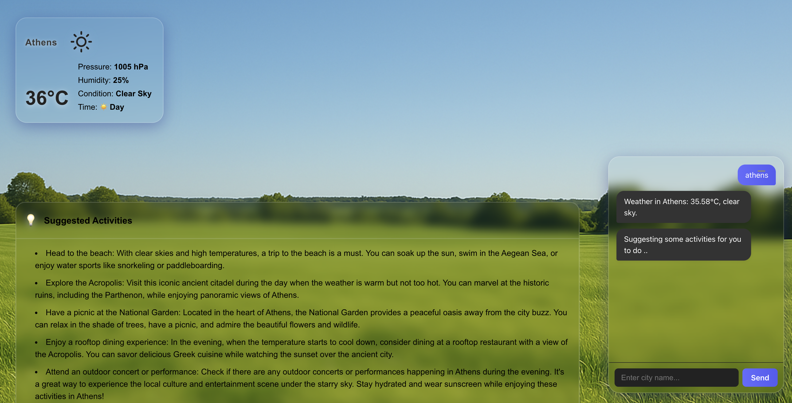
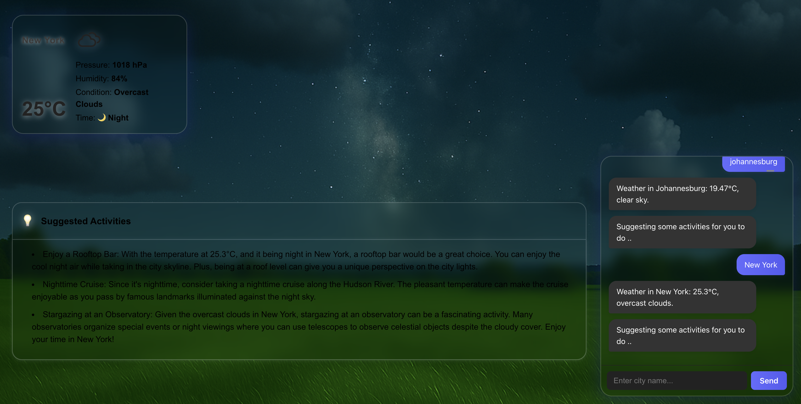

# Weather App

A modern React + Vite application that provides real-time weather information, activity suggestions, and a conversational chatbot interface. The app features dynamic backgrounds based on weather and time of day, and leverages OpenAI and weather APIs for intelligent suggestions.

## Features

- **Weather Widget:** Displays current weather, temperature, humidity, pressure, and conditions for a user-specified city.
- **Activity Suggestions:** Recommends activities tailored to the weather and time of day, powered by AI.
- **Chatbot:** Conversational interface for entering city names and receiving weather/activity info.
- **Dynamic Backgrounds:** Visuals change based on weather and time (day, night, evening).
- **Responsive UI:** Clean, modern, and mobile-friendly design.

## Getting Started

### Prerequisites

- [Node.js](https://nodejs.org/) (v20+ recommended)
- [npm](https://www.npmjs.com/) (comes with Node.js)

### Installation

1. **Clone the repository:**
   ```sh
   git clone <your-repo-url>
   cd weatherapp
   ```

2. **Install dependencies:**
   ```sh
   npm install
   ```

3. **Set up environment variables:**

   Create a `.env` file in the project root with the following variables:

   ```
   VITE_OPENAI_API_URL=<your-openai-api-endpoint>
   VITE_OPENAI_API_KEY=<your-openai-api-key>
   VITE_WEATHER_API_URL=<your-weather-api-endpoint>
   VITE_WEATHER_API_KEY=<your-weather-api-key>
   ```

   - For weather data, you can use [OpenWeatherMap API](https://openweathermap.org/api).
   - For AI suggestions, you need access to an OpenAI-compatible API endpoint.

### Development

To start the app in development mode with hot reloading:

```sh
npm run dev
```

The app will be available at [http://localhost:5173](http://localhost:5173) by default.

### Building for Production

To build the app for production:

```sh
npm run build
```

The output will be in the `dist/` directory.

### Previewing Production Build

To locally preview the production build:

```sh
npm run preview
```

### Running the Production Server

A simple Express server is included for serving the built app:

```sh
npm start
```

By default, the server runs on port `8080` (or the value of the `PORT` environment variable).

## Project Structure

```
weatherapp/
  public/           # Static assets and background images
  src/              # React components and styles
    components/     # WeatherWidget, ActivityWidget, Chatbot, etc.
  server.cjs        # Express server for production
  index.html        # App entry point
  package.json      # Scripts and dependencies
  vite.config.js    # Vite configuration
```

## Customization

- **Backgrounds:** Add or replace images in `public/` to customize weather backgrounds.
- **API Keys:** Never commit your `.env` file or API keys to version control.

## License

MIT

## Example Images

Below are some example background images used in the app (located in `public/`):

| Cloudy Day                | Rainy Night                | Snowy Day                 | Sunny Day                 |
|---------------------------|----------------------------|---------------------------|---------------------------|
|  |  |  |  |

| Cloudy Night              | Rainy Day                  | Snow Evening              | Storm Day                 |
|---------------------------|----------------------------|---------------------------|---------------------------|
|  |  |  |  |

You can find and customize more backgrounds in the `public/` directory.


Below are some examples of the app running on localhost (located in `examples/`):


| Athens                | Cluj                  | Johannesburg              | New York                 |
|---------------------------|----------------------------|---------------------------|---------------------------|
|  |  |  |  |

